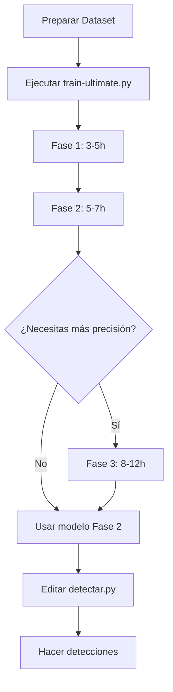

#  Guía de Entrenamiento YOLO Ultimate

##  Estructura de Archivos

```
NeuroEvol-Threat-master/
├── datasetSospecha/
│   ├── images/
│   │   ├── train/
│   │   └── val/
│   ├── labels/
│   │   ├── train/
│   │   └── val/
│   └── dataset.yaml
├── runs/
│   └── detect/
│       ├── fase1_turbo/
│       ├── fase2_refinado/
│       └── fase3_maxima/
├── resultados/
│   ├── entrenamiento_log.txt
│   └── resumen_final.txt
├── train.py                    #  TU ARCHIVO ACTUAL (obsoleto)
└── detectar.py                # Para usar después del entrenamiento
```

##  Archivos Principales

### 1. **train-ultimate.py** (NUEVO)
Entrenamiento optimizado por fases con RAM maximizada

### 2. **train.py** (VIEJO)
Tu archivo actual - puedes respaldarlo o eliminarlo

### 3. **detectar.py** (EXISTENTE)
Para hacer detecciones después del entrenamiento

---

##  Cómo Ejecutar

### **Paso 1: Preparar el entorno**

```bash
# Abre la terminal en VS Code (Ctrl + `)
cd NeuroEvol-Threat-master

# Verifica que tengas ultralytics instalado
pip install ultralytics
```

### **Paso 2: Verificar tu dataset**

Asegúrate de que `datasetSospecha/dataset.yaml` existe y tiene este formato:

```yaml
path: datasetSospecha
train: images/train
val: images/val

names:
  0: clase1
  1: clase2
  # ... tus clases
```

### **Paso 3: Ejecutar el entrenamiento**

```bash
# Ejecuta el nuevo script optimizado
python train-ultimate.py
```

---

##  Tiempos Estimados

| Fase | Tiempo | Descripción |
|------|--------|-------------|
| **Fase 1** | 3-5 horas | Entrenamiento rápido (320px) |
| **Fase 2** | 5-7 horas | Refinamiento (416px) |
| **Fase 3** | 8-12 horas | Máxima calidad (640px) - OPCIONAL |

**Total recomendado (Fase 1+2): 8-12 horas**

---

## Opciones de Ejecución

### Opción A: Rápido (Solo Fase 1 + 2)
```bash
python train-ultimate.py
# Cuando pregunte por Fase 3, escribe: n
```
**Tiempo: ~8-12 horas**

### Opción B: Máxima Calidad (Todas las fases)
```bash
python train-ultimate.py
# Cuando pregunte por Fase 3, escribe: s
```
**Tiempo: ~16-24 horas**

### Opción C: Modificar el código
Edita `train-ultimate.py` y ajusta:
```python
# Línea ~450 - Cambiar epochs
epochs=12  # Reduce a 8 para más rápido
epochs=20  # Aumenta para más precisión
```

---

## Resultados del Entrenamiento

Después de ejecutar, encontrarás:

```
runs/detect/
├── fase1_turbo/
│   ├── weights/
│   │   ├── best.pt      # Mejor modelo de Fase 1
│   │   └── last.pt      # Último checkpoint
│   └── results.csv      # Métricas
├── fase2_refinado/
│   └── weights/
│       └── best.pt      #  RECOMENDADO USAR ESTE
└── fase3_maxima/
    └── weights/
        └── best.pt      # Máxima calidad (si ejecutaste)

resultados/
├── entrenamiento_log.txt
└── resumen_final.txt
```

---

##  Después del Entrenamiento

### Usar tu modelo para detección:

Edita `detectar.py` y cambia la ruta del modelo:

```python
# En detectar.py
model = YOLO("runs/detect/fase2_refinado/weights/best.pt")
```

### Evaluar el modelo:

```python
from ultralytics import YOLO

model = YOLO("runs/detect/fase2_refinado/weights/best.pt")
metrics = model.val(data="datasetSospecha/dataset.yaml")

print(f"mAP50: {metrics.box.map50}")
print(f"mAP50-95: {metrics.box.map}")
```

### Continuar entrenamiento:

```python
from ultralytics import YOLO

# Cargar el último modelo
model = YOLO("runs/detect/fase2_refinado/weights/last.pt")

# Continuar entrenando 10 epochs más
model.train(
    data="datasetSospecha/dataset.yaml",
    epochs=10,
    resume=True
)
```

---

##  Solución de Problemas

### Problema 1: "No se encuentra el dataset"
```bash
# Verifica que existe:
dir datasetSospecha\dataset.yaml  # Windows
ls datasetSospecha/dataset.yaml   # Linux/Mac
```

### Problema 2: "Error de memoria (RAM)"
Edita `train-ultimate.py`:
```python
# Línea ~95 - Reduce batch y workers
batch=4,    # En lugar de 10
workers=4,  # En lugar de 8
cache='disk',  # En lugar de True
```

### Problema 3: "Muy lento"
1. Cierra todas las aplicaciones
2. Desactiva antivirus temporalmente
3. Reduce epochs en el código

### Problema 4: "Se interrumpió el entrenamiento"
```python
# Para reanudar:
from ultralytics import YOLO
model = YOLO("runs/detect/fase1_turbo/weights/last.pt")
model.train(resume=True)
```

---

##  Consejos

### Antes de ejecutar:
- Cierra navegadores, Discord, Steam, etc.
- Conecta la laptop al cargador
- Desactiva modo de ahorro de energía
- Ten al menos 10GB de RAM libre

### Durante el entrenamiento:
- Monitorea con Task Manager (Ctrl+Shift+Esc)
- Puedes pausar con Ctrl+C (guarda automáticamente)
- NO desconectes el cargador

### Después del entrenamiento:
- Respalda la carpeta `runs/detect/`
- evisa los gráficos en `runs/detect/fase2_refinado/`
-Prueba el modelo con imágenes nuevas

---

## Comparación con tu código anterior

| Característica | train.py (viejo) | train-ultimate.py (nuevo) |
|----------------|------------------|---------------------------|
| Velocidad | ⭐ | ⭐⭐⭐⭐⭐ |
| Uso de RAM | 2-3 GB | 10-12 GB |
| Estructura | Simple | Por fases |
| Tiempo total | 60-80 horas | 8-12 horas |
| Cache | False | True (RAM) |
| Workers | 2 | 8 |
| Batch | 4 | 8-10 |
| Logs | No | Sí |

---

## Flujo de Trabajo Completo



---

## Notas Finales

- El script guarda **checkpoints automáticos** cada 4-5 epochs
- Puedes **pausar y reanudar** en cualquier momento
- Los **logs** se guardan automáticamente en `resultados/`
- **Fase 3 es opcional** - solo si necesitas máxima precisión

¿Dudas? Revisa los logs en `resultados/entrenamiento_log.txt`